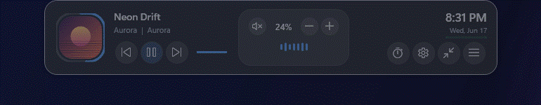
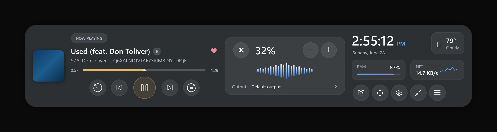

# Dynamic Island for Windows

A native **Windows desktop "Dynamic Island"** — a polished, always-on-top pill that
sits at the top-center of your screen and expands on hover into a wide, restrained
smoked-charcoal panel showing **now-playing media, system volume, an audio
equalizer, the clock, date, weather, RAM/network, battery, and a timer/alarm**.

Built in **C# + WPF on .NET 10**, rewritten from an original Python/Tkinter
prototype. The complete evolution of Python prototypes that led here is preserved
in [`python-versions/`](python-versions/).

<p align="center">
  
</p>

<p align="center">
  <a href="../../releases/latest/download/DynamicIsland.exe">
    
  </a>
  &nbsp;
  <a href="../../releases/latest"></a>
</p>

<p align="center">
  
  
  
</p>

<!-- Optional: add a live version badge once pushed by replacing OWNER/REPO:
      -->


<p align="center">
  <b>No install, no build</b> — download the self-contained <code>.exe</code> and double-click. Nothing else required.
</p>

---

## The expanded island

<p align="center">
  
</p>

Three precise sections on one wide overlay:

| Left — Now Playing | Center — Audio | Right — Status |
| --- | --- | --- |
| Album art, a **`NOW PLAYING`** squircle chip, title + explicit badge + favorite, artist/source, a gold progress timeline, and a **5-button transport** | Speaker, volume %, −/+, a live blue **equalizer**, and a clickable **Output** device row | Clock + AM/PM, date, weather card, **RAM** & **network** cards, and a row of circular quick actions |

The transport is, in order: **⟲10 · prev · play/pause · next · 10⟳**. The rewind
and fast-forward buttons jump exactly **10 seconds** and clamp to the start/end of
the track; they gray out with an explanatory tooltip when the active media app
can't seek.

---

## Animations & screenshots

| Open / hold / close | Mid-collapse | Compact pill |
| --- | --- | --- |
|  |  |  |

> The animated GIFs capture the live hover/expand motion; `media/expanded.png` is a
> pixel render of the current redesigned layout. An earlier design is kept at
> `media/expanded-classic.png` for reference.

---

## Features

- **Compact ↔ expanded** — a rounded pill that animates smoothly to a wide glass
  panel on hover (120–220 ms, no bounce) and collapses again after a short delay.
- **Media** — title/artist, artwork, explicit & favorite indicators, a gold
  progress bar with elapsed/remaining time, and **rewind-10 / previous /
  play-pause / next / forward-10** controls via the Windows
  `GlobalSystemMediaTransportControls` (GSMTC) API. When several apps have media
  sessions, the most relevant one is scored and chosen — never blindly the first.
- **Seek** — 10-second backward/forward seeking with clamping at 0 and track end;
  disables gracefully when the provider doesn't support position changes.
- **Audio** — master volume, mute, output-device readout, and a live
  WASAPI-loopback **equalizer** (with a tasteful idle animation when nothing is
  playing), via CoreAudio interop.
- **System monitor** — live **RAM** usage bar and a **network** throughput
  sparkline.
- **Clock, date & weather** — 12/24-hour time on a one-second tick, long date, and
  a current-conditions weather card.
- **Battery & charging** — percentage plus a dedicated charging capsule; degrades
  cleanly on desktops with no battery.
- **Timer & alarm** — presets and custom durations, a *done* state with sound,
  snooze/dismiss, and state that survives a restart.
- **Quick actions** — camera presence, timer, settings, collapse, and a menu, as
  one row of equal circular buttons.
- **System integration** — per-monitor-V2 DPI aware, multi-monitor aware,
  single-instance, hidden from Alt-Tab, optional launch-on-startup, optional
  click-through when compact, reduced-motion support, full light/dark theming, and
  a tray menu.
- **Privacy-first** — no analytics, accounts, cloud, or network calls beyond
  optional weather and one-time camera-model downloads. Everything runs locally.

---

## Design language

Restrained premium Windows-style **smoked charcoal**, not flashy glassmorphism:
dark graphite surfaces, low-opacity translucency, a faint backdrop, one thin
gray-blue outline, and soft shadows. Color is used sparingly — **muted gold** only
for the media progress, and **muted blue** only for live system visualizations
(equalizer, RAM fill, network sparkline). Iconography is **Segoe Fluent Icons**
throughout; type is **Segoe UI Variable**.

---

## Get it

### Option 1 — Download the app (easiest)

1. Go to the **[latest release](../../releases/latest)** and download
   **`DynamicIsland.exe`** (or use the green button above).
2. Double-click it. The build is **self-contained** — no .NET, no installer,
   nothing else to set up.

The island appears at the top-center of your primary monitor and lives in the
system tray (right-click for Settings, Recenter, Quit). Windows SmartScreen may
warn about an unsigned app the first time — choose *More info → Run anyway*.

> The `.exe` is ~287 MB (it bundles the .NET runtime), which is over GitHub's
> 100 MB per-file limit, so it's distributed as a **release asset** rather than
> committed to the repo.

### Option 2 — Build from source

Requirements: **Windows 10 1809+ (Windows 11 recommended)** and the **.NET 10
SDK**. From the repository root:

```powershell
dotnet build .\DynamicIsland.slnx -c Debug
dotnet run --project .\DynamicIsland.Windows
```

Run the tests:

```powershell
dotnet test .\DynamicIsland.Windows.Tests
```

Publish a self-contained single-file executable (no .NET needed on the target):

```powershell
dotnet publish .\DynamicIsland.Windows -c Release -r win-x64
```

> This project was developed with a workspace-local .NET SDK. If a global
> `dotnet` reports "No .NET SDKs were found", install the .NET 10 SDK (or use the
> local toolchain that shipped during development).

### Publishing a release (maintainers)

So the **Download** button resolves, attach the published exe to a GitHub Release
named exactly `DynamicIsland.exe`:

```powershell
dotnet publish .\DynamicIsland.Windows -c Release -r win-x64
# rename/copy the output to DynamicIsland.exe, then:
gh release create v1.0.0 ".\DynamicIsland.Windows\bin\Release\net10.0-windows10.0.19041.0\win-x64\publish\DynamicIsland.Windows.exe#DynamicIsland.exe" --title "v1.0.0" --notes "First release"
```

The `#DynamicIsland.exe` suffix uploads the asset under that name, which is what the
`releases/latest/download/DynamicIsland.exe` link points to.

---

## Repository layout

```
DynamicIsland/
├── DynamicIsland.Windows/         Main app — the Windows version (C# + WPF, .NET 10)
│   ├── Models/                    Plain state records (settings, media, audio, battery, …)
│   ├── Services/                  One responsibility each (media, audio, monitor, weather, …)
│   ├── Interop/                   Isolated P/Invoke + CoreAudio COM interfaces
│   ├── ViewModels/                MVVM view models
│   ├── Views/                     IslandWindow, SettingsWindow, TimerAlarmWindow (XAML)
│   └── Infrastructure/            ObservableObject, RelayCommand, SeekMath, …
├── DynamicIsland.Windows.Tests/   xUnit tests (e.g. 10s-seek clamping)
├── DynamicIsland.slnx             Solution
├── MIGRATION_REPORT.md            Python → C# audit, feature mapping, test results
├── media/                         Animations & screenshots used by this README
└── python-versions/               Archived Python/Tkinter prototypes (not built)
```

All Windows interop is isolated under `Interop/`; P/Invoke is not scattered through
the UI. See [`MIGRATION_REPORT.md`](MIGRATION_REPORT.md) for the full feature audit
and what was preserved vs. improved.

---

## The Python prototypes

Before the native rewrite, the island went through many Python/Tkinter
explorations — different shapes, dock positions, an animated progress ring, a
premium build, and an optional camera-presence version. They're all kept, with a
guide to each, in **[`python-versions/`](python-versions/)**.

---

## License

Released under the **MIT License** — see [`LICENSE`](LICENSE). (Swap in a different
license if you prefer.)
